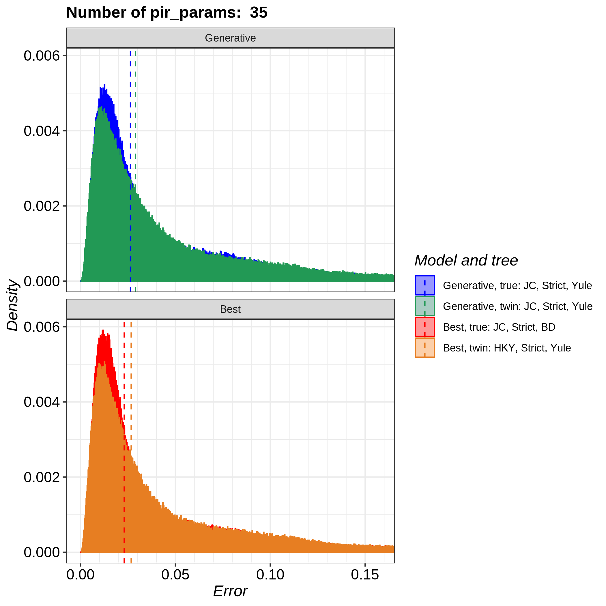
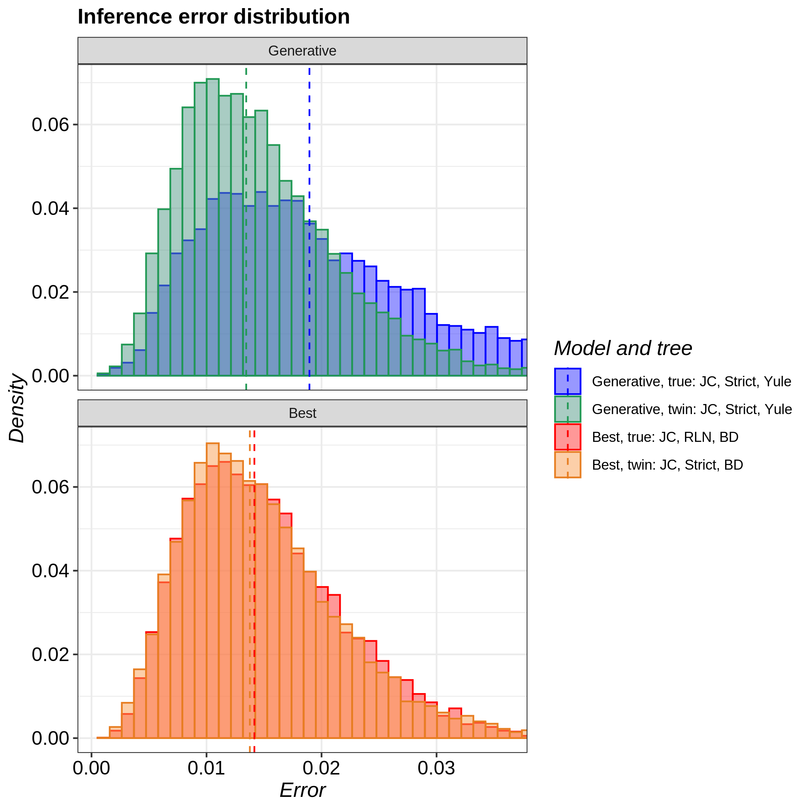
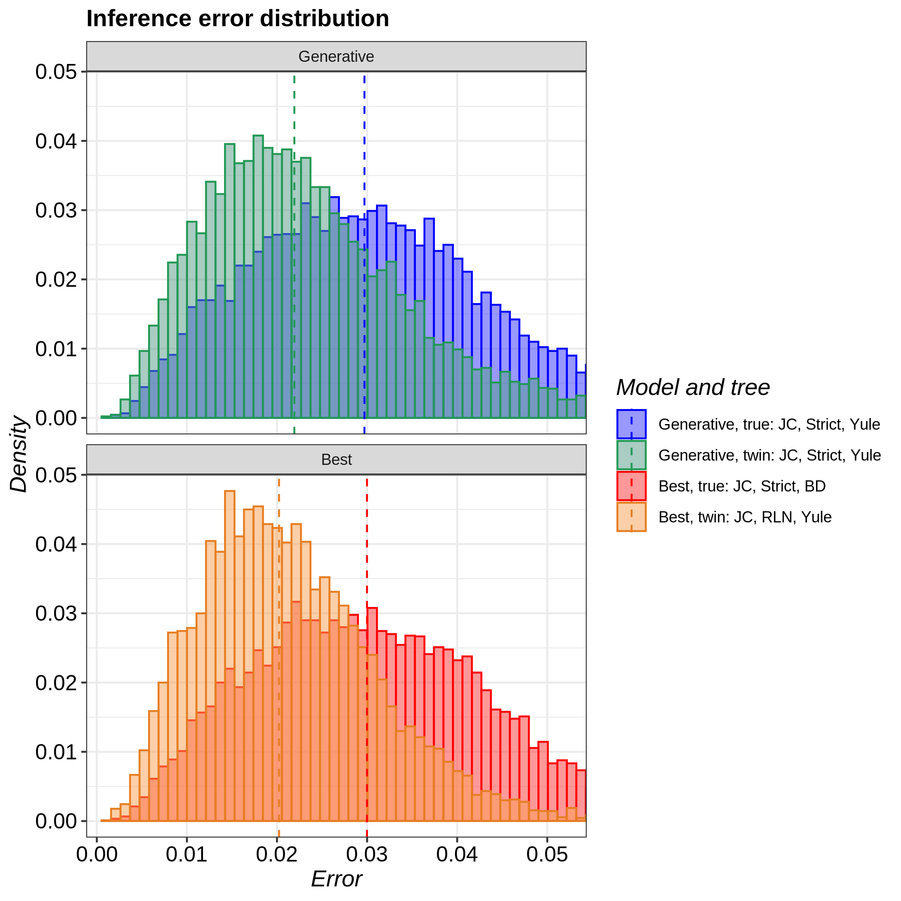
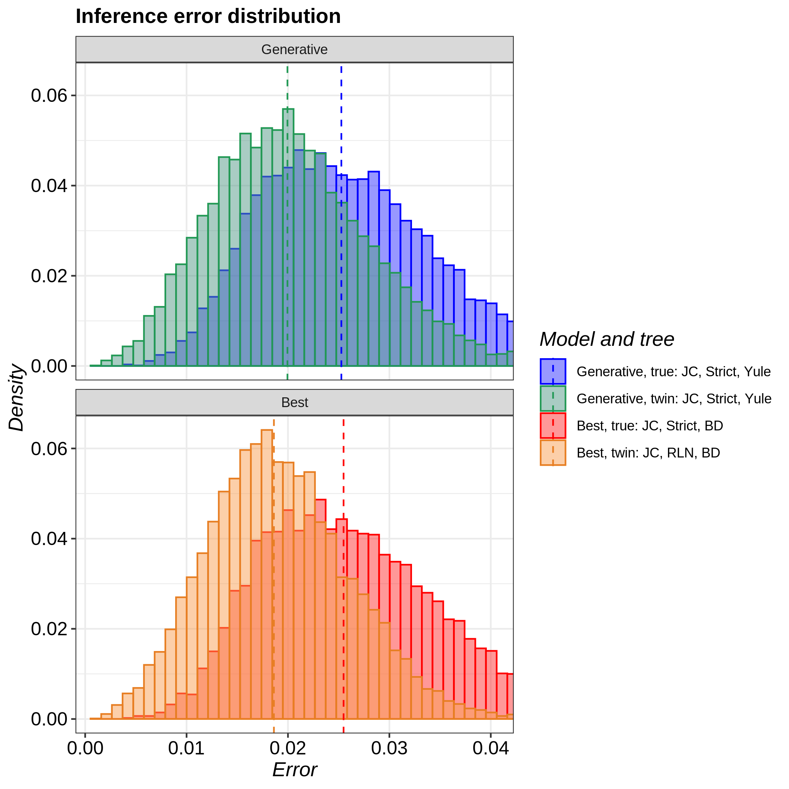
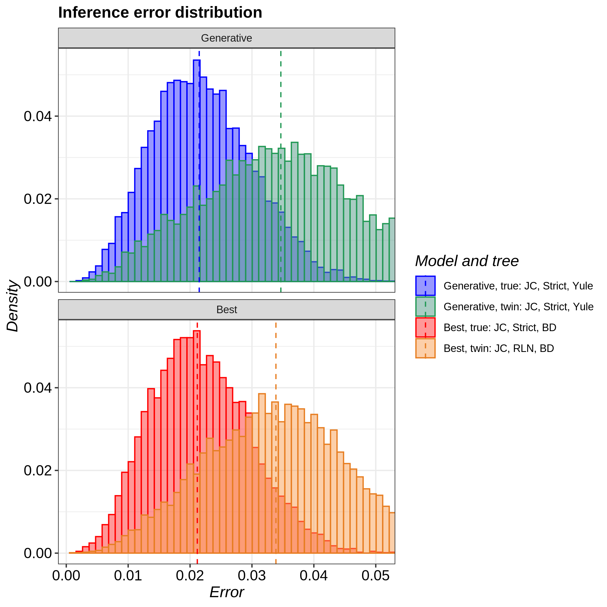
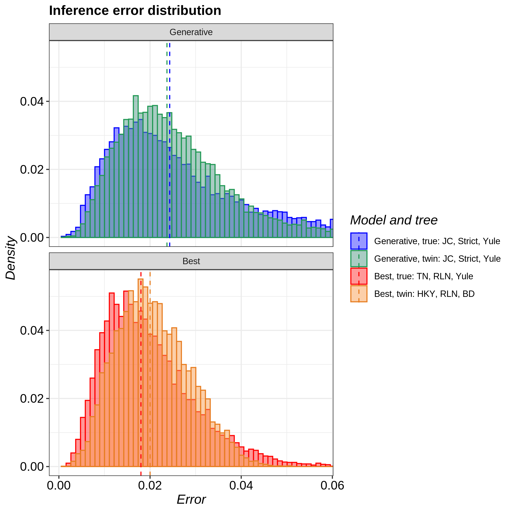
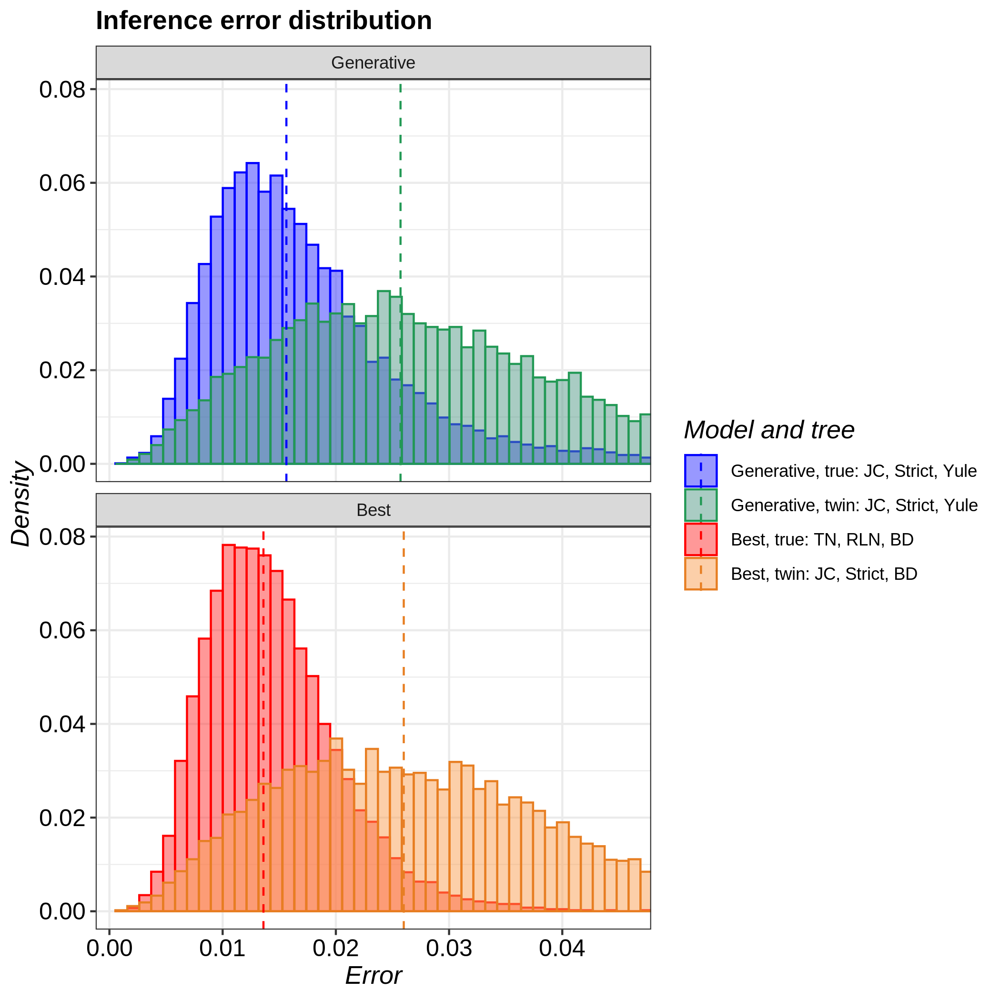
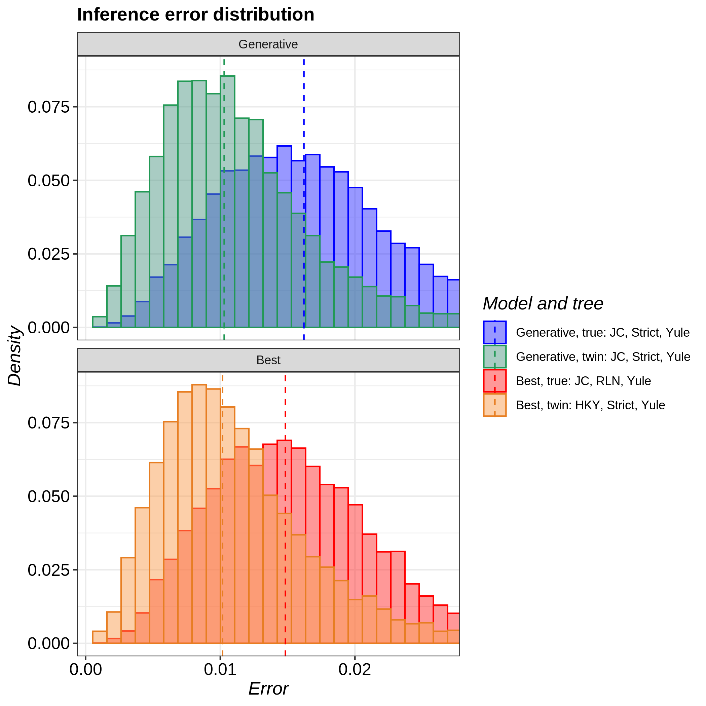

# pirouette_example_24

Branch   |                                                                                                 |                                                                                               
---------|--------------------------------------------------------------------------------------------------------------------------------------------------------------|--------------------------------------------------------------------------------------------------------------------------------------------------------------------------------------------
`master` | |
`develop`||

A [pirouette example](https://github.com/richelbilderbeek/pirouette_examples) 
that shows examples with mutation rates of 0.0125, 0.025, 0.05, 0.1, 0.2, 0.4, 0.8.

## Summary

### Individual

Per-nucleotide mutation rate of 0.0125:

Per-nucleotide mutation rate of 0.025:

Per-nucleotide mutation rate of 0.05:

Per-nucleotide mutation rate of 0.1:

Per-nucleotide mutation rate of 0.2:

Per-nucleotide mutation rate of 0.4:

Per-nucleotide mutation rate of 0.8:

