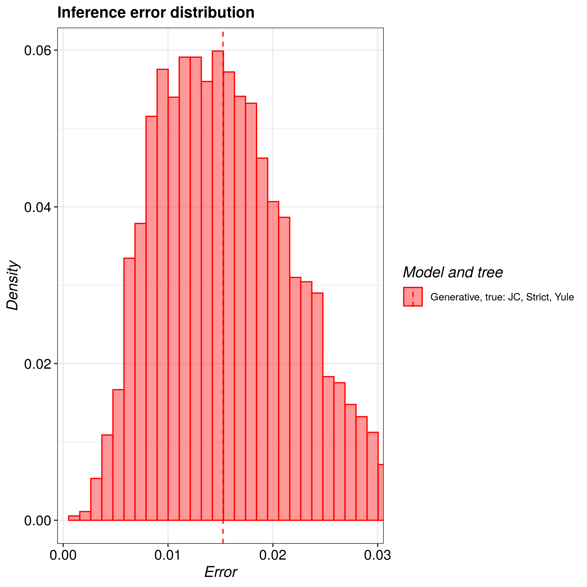

# pirouette_example_24

Branch   |                                                                                                 |                                                                                               
---------|--------------------------------------------------------------------------------------------------------------------------------------------------------------|--------------------------------------------------------------------------------------------------------------------------------------------------------------------------------------------
`master` | |?
`develop`||?

A [pirouette example](https://github.com/richelbilderbeek/pirouette_examples) 
that shows examples with mutation rates of 0.0125, 0.025, 0.05, 0.1, 0.2, 0.4, 0.8.

## Results

